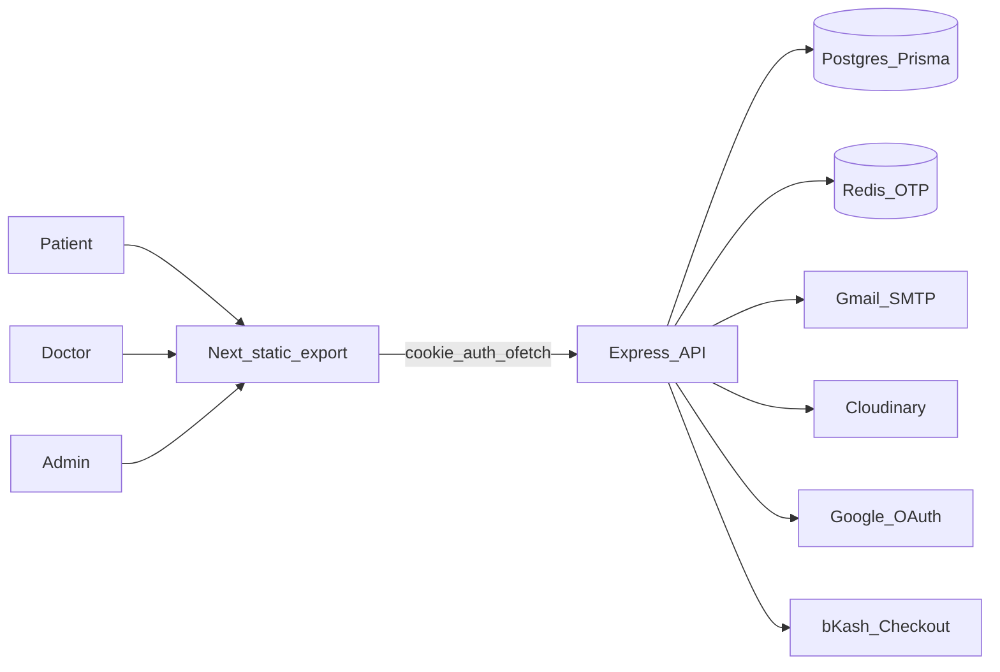

# Case study: HealthCare Service

**A multi-role booking platform for patients, doctors, and admins — with bKash checkout, OTP auth, and separate dashboards.**

---

### TL;DR

I built HealthCare Service as a fullstack product: patients find verified doctors, book a slot, pay in BDT via bKash, and get a PDF prescription afterward. Doctors manage schedules and appointments. Admins approve who shows up on the public list.

Stack in one breath: Express 5 + Prisma/Postgres API, Next 16 static export frontend, Redis for OTPs, Gmail SMTP, Cloudinary, Google login, bKash tokenized checkout.

Worth knowing if you’re hiring for something similar: the payment path was designed around gateway failure (not the happy path only), doctor supply is gated behind admin approval, and the frontend is a typed client of a real API — not mock data behind pretty screens.

If you need a clinic OS, telehealth booking, or any multi-role marketplace with local payments, this is the same shape of system. Details (and the tradeoffs) below.

**[Your name]** · Fullstack engineer · Timeline: _[fill in]_ · Contact: _[email / Calendly]_

---

## The business problem

Healthcare marketplaces fail in boring, expensive ways.

Patients bounce when they can’t finish three steps in one sitting: find someone trustworthy, grab a time that still exists, pay without leaving the flow. Platforms that skip verification end up listing anyone with a CV — and once trust breaks, ads don’t fix it. Ops teams get stuck with one shared admin panel where a doctor can see things they shouldn’t, or an admin has to dig through patient records to approve a resume.

And if your users are in Bangladesh, “we’ll add Stripe later” is not a payment strategy. Money moves on bKash. The product has to respect that.

What I aimed the build at:

- Unverified doctors never hit the public catalog until an admin says so.
- Slots are real schedule rows with DB constraints that stop the obvious double-book cases.
- A flaky payment gateway doesn’t erase the booking — the patient can retry.
- Fake or typo’d emails don’t become permanent accounts (OTP first).
- After the visit, the doctor sends a PDF prescription (Cloudinary + email), not a half-built pharmacy database.

---

## Scope

| | |
| --- | --- |
| Product | HealthCare Service |
| Roles | `PATIENT`, `DOCTOR`, `ADMIN`, `SUPER_ADMIN` |
| Backend | Express modules: auth, user, doctor, schedule, appointment, payment, prescription, analytics |
| Frontend | Next 16 static export; role-guarded dashboards; ~109 / 112 of the v1 task list done |
| Data | User, Patient, Doctor, Schedule, Appointment, Payment |

I owned the fullstack shape: API as source of truth, UI as a careful consumer. The backend lives in `Healthcare-Backend`; the live frontend work is in `healthcare-frontend` (not the older fork).

---

## Architecture — what I used and why

I didn’t pick a stack to look modern. Each piece answers a constraint — hosting cost, Bangladesh payments, cookie auth across ports 3000 and 5000, or “don’t put one-time secrets in Postgres.”

### Split API and frontend

Two repos. Express owns every route under `/api/v1`. Next is a static export that talks to that API with `credentials: "include"`.

Why: the API stays swappable (mobile client later, different marketing site, Postman for QA). Putting everything in Next Route Handlers would fight the static export choice and blur where auth actually lives.

What I skipped: a Next monolith with server actions as the backend. Fine for smaller apps. Wrong here once you have bKash callbacks, Redis OTP, and role-heavy modules.

### Express modules: route → controller → service → validation

Controllers stay thin (`catchAsync` + `sendResponse`). Services own Prisma and business rules. Zod schemas sit on write routes via `validateRequest`.

Why: when appointment booking grew a payment side-effect, I didn’t want that logic buried in a 400-line controller. New features copy an existing module folder and mount in `app.ts`.

Rejected: Prisma calls straight from route handlers. It ships faster on day one and becomes untestable mush by week three.

### Prisma 7 + Postgres, schema split by domain

Models live in separate files (`user.prisma`, `appointment.prisma`, `payment.prisma`, …). Migrations and typed client generation are part of the normal loop.

Why: healthcare data is relational — patients, doctors, schedules, unique booking constraints. Postgres fits. Splitting the schema keeps each domain readable instead of one 800-line file.

Deferred: raw SQL-only. I’d reach for it for a nasty report query, not as the default.

### JWT in httpOnly cookies (access + refresh)

Login sets `accessToken` / `refreshToken` cookies. The frontend never parks tokens in `localStorage`. `ofetch` sends cookies cross-origin; backend CORS allowlists the frontend URL.

Why: XSS that can read JS storage shouldn’t automatically steal the session. Refresh rotation keeps the access token short-lived.

I didn’t use “store the JWT in memory/localStorage and slap Bearer on every call” as the primary path — that’s the default tutorial and a bad default for a browser app. Bearer still works as a fallback for tools like Postman.

### Redis for OTPs and pending registration

Forgot-password and email verification OTPs go in Redis with a TTL (five minutes for reset). Keys die on their own. Successful reset deletes the key so it can’t be reused.

Why: these secrets are temporary. Parking them in Postgres means cleanup jobs and a wider blast radius if the DB dumps.

### Gmail SMTP for v1 mail

Nodemailer + Gmail app password. Server boot calls `transporter.verify()` — if mail creds are wrong, the process exits instead of discovering that on the first signup.

Why: transactional mail for OTP and welcome messages without standing up SES on day one. At real volume I’d move to Resend/SES. Gmail limits are a known ceiling, not a surprise.

### Cloudinary for profile images and prescription PDFs

Multer keeps uploads in memory; Cloudinary gets the buffer. Replacing a profile image uploads the new one, updates the user row, then destroys the old `public_id`. Prescriptions are PDFKit → upload → URL on the appointment → email.

Why: no binary blobs in Postgres, no local disk on ephemeral hosts. CDN URL is what the UI and email need anyway.

### Google ID-token login with account linking

Patients can sign in with Google. If they already registered with email/password, the flow links `googleId` instead of creating a second user with the same email.

Why: signup friction kills marketplaces. Duplicate accounts create support tickets. Linking is the boring correct behavior.

### bKash tokenized checkout, amounts in BDT

Booking creates a payment against bKash’s checkout API and returns `bkashURL`. Callbacks land on the API; the frontend just reads `?status=` for the result banner. Currency defaults to BDT on the Payment model.

Why: that’s how users here actually pay. Stripe-first would be a portfolio flex and a product miss.

### Next 16 static export + React Compiler

`output: "export"` writes an `out/` folder. No Next middleware, no server actions, no API routes. Dashboards are client apps over React Query.

Why: cheap static hosting. Most of this product is authenticated UI talking to Express — it doesn’t need a Node server next to the HTML.

Tradeoff (real one): doctor detail pages are generated at build via `generateStaticParams`. A newly approved doctor’s `/doctors/[id]` page only exists after the next build. v1 accepted that. If listings must go live instantly, that route becomes SSR/ISR or a client-only shell — not a surprise rewrite of the whole app.

### Frontend data layer: `api` → hooks → UI

Typed wrappers unwrap `response.data`. Hooks own query keys and invalidate on mutation success. Forms use TanStack Form with Zod schemas that mirror backend rules.

Why: I got tired of every page inventing its own fetch and cache story. One envelope shape (`success`, `statusCode`, `message`, `data`, `meta`) on both sides means list pagination doesn’t drift.

UI primitives come from shadcn on `@base-ui/react` — enough consistency for dashboards without inventing a design system. Each dashboard segment wraps children in `RoleGuard`; the API still enforces roles with `auth(...roles)`. Frontend guards are UX. Backend guards are security.

### Conventions that matter more than the logo on the README

- Never `prisma.create({ ...req.body })` — destructure explicitly.
- Boot order: connect Prisma → Redis → verify SMTP → seed → listen. Missing Redis or bad mail creds fail the process.
- Frontend does not pretend to be the backend.

If this went into a production clinic tomorrow, I’d harden rate limits on OTP and login, set cookie `secure` / `sameSite` correctly for HTTPS, swap Gmail for a real ESP, and revisit live doctor pages if ops can’t wait on rebuilds. That’s a checklist, not a rewrite.

---

## How specific problems got solved

### Doctor supply without wrecking trust

Open listings with zero verification is how marketplaces get spam and liability in the same week.

Doctors apply with profile data plus multipart files (resume, extras). They land as `PENDING`. Admins work an approval queue; only `APPROVED` doctors belong on the public surface patients book from. Rejection is a first-class state, not a deleted row you can’t explain later.

That’s an onboarding gate. The product is less “directory of anyone” and more “directory we stand behind.”

### Booking first, bKash second

Gateway calls are slow and fail. Holding a Postgres transaction open across two bKash round-trips would pin a pool connection for the whole wait — and if the gateway dies mid-flight, you don’t want to invent a weird half-state by accident.

So the flow is deliberate: create the `PENDING` appointment inside a transaction, commit, _then_ talk to bKash. If checkout creation fails, the appointment stays. Same state `payAppointment` resumes from, so retry doesn’t mean “book again and hope.”

One more sharp edge: paying someone else’s invoice. Early versions of “pass an appointment id and open checkout” are a gift to attackers. The pay path checks ownership against the logged-in patient before starting bKash. That check exists because the failure mode is ugly — victim gets booked, attacker never intended to show up.

### Auth that matches how people actually sign up

Registration doesn’t write a permanent user until email OTP checks out. Reset password stores a six-digit code in Redis for five minutes, single use. Google login links to an existing credential patient when the email already exists, instead of exploding on the unique constraint.

Cookies carry the session. Role is part of the token story; change someone’s role and they need a fresh login — annoying in demos, correct when admin privileges are involved.

I’m not going to pretend v1 is locked down like a bank. OTP attempt limiting and production cookie flags are on the hardening list. Shipping OTP-in-Redis beats shipping “trust the email field.”

### Static hosting vs a live doctor catalog

I wanted the marketing site and dashboards on static hosting. That choice collides with “every doctor id is a page.”

Build-time crawl via `generateStaticParams` is the compromise. Harden the crawl so a bad page 2 doesn’t silently export only page 1. Document that new approvals need a rebuild. Clients understand “rebuild to publish” when you say it up front; they hate discovering 404s after launch.

### Prescriptions without building a pharmacy ERP

There’s no `Prescription` model full of medicines. The doctor generates a PDF, it goes to Cloudinary, the appointment stores `prescriptionUrl`, the patient opens a viewer (and empty means “not written yet,” not a red error banner).

Clinics already think in “send the PDF.” Modeling a full formulary would have doubled the scope for a feature nobody asked to edit inline.

---

## Screenshots (drop images here)

| Shot | Caption |
| --- | --- |
| _[img]_ | Public doctors / available today |
| _[img]_ | Book flow → bKash redirect / payment result banner |
| _[img]_ | Patient appointments + payment history |
| _[img]_ | Doctor schedules + appointments |
| _[img]_ | Admin doctor approval + analytics |
| _[img]_ | Register OTP / Google login / forgot-password |

---

## What’s actually in the box (honest numbers)

No fake MAU. No invented “reduced no-shows by 40%.” What’s true from the repo:

- Four roles, each with its own dashboard segment and server-side auth checks
- On the order of **43** backend module routes; the frontend v1 list sits at about **109 / 112** complete against that API
- Six core domain models wired through Prisma
- Live integrations: Redis, Gmail SMTP, Cloudinary, Google OAuth, bKash
- Process artifacts I actually use: a feature build log (`steps.md`), a frontend execution backlog (`TASKS.md`), and a checked-in Postman collection for API smoke checks

Tests and CI aren’t there yet. Verification today is typecheck + manual UI + Postman. I’d add those early on a paid production engagement — different risk profile than a v1 product build.

---

## What this means if you hire me

Same shape of work, different logo:

- Multi-sided SaaS where patients, providers, and admins don’t share one UI
- Booking + a local payment gateway (bKash or the equivalent in your market)
- Auth that includes OTP, OAuth, and cookie sessions — not a toy login form
- Admin ops: approval queues, lists with filters/sort, role analytics
- Fullstack delivery with a boring, copyable module layout on the API and a typed `api → hooks → UI` lane on the client

If your brief is “clinic booking in eight weeks” or “marketplace MVP with payouts later,” we start from this pattern and cut what you don’t need — we don’t start from a blank CRUD tutorial.

### How I’d run your project

1. Discovery: roles, money flow, what must be true on day one vs later.
2. Module map: auth → core entity → booking/payment → admin ops.
3. Vertical slices you can click every week — not a three-month big bang.
4. Hardening pass before real users: rate limits, cookie flags, email provider, backup/monitoring.

---

## Next step

If this matches a problem you’re sitting on, let’s talk scope and timeline.

- Portfolio: _[URL]_
- GitHub: _[Healthcare-Backend / healthcare-frontend]_
- Email: _[you@domain]_
- Book a call: _[Calendly]_
